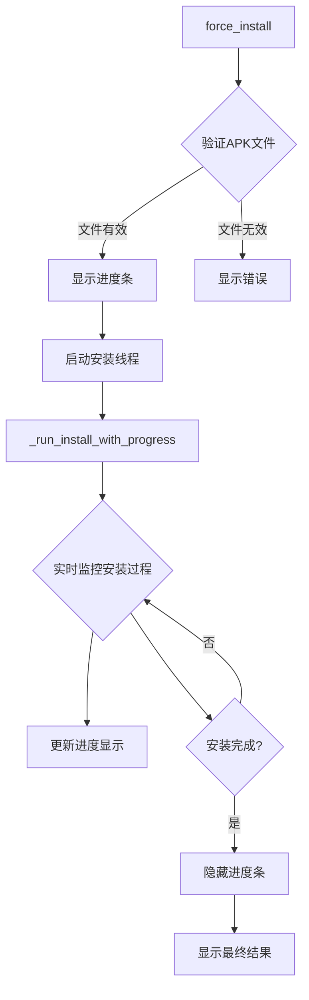
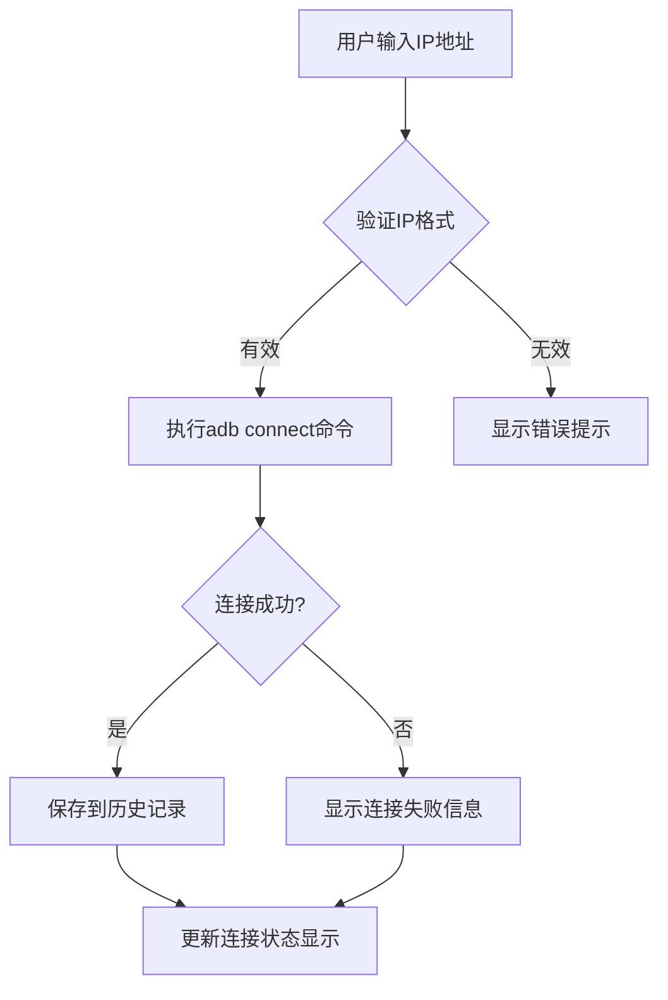
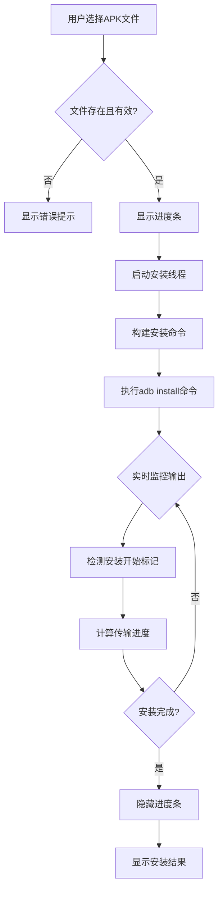

# ADB工具架构逻辑详细介绍

## 🏗️ 项目概述

这是一个基于Python Tkinter的高级ADB(Android Debug Bridge)工具，专为多设备管理和Android开发调试设计。该工具提供了完整的GUI界面，支持批量设备操作、应用管理、日志捕获、屏幕录制等核心功能。

## 📁 项目结构详解

```
New_Adbtools/
├── app.py                 # 核心应用类和主逻辑
├── main.py               # 程序入口点
├── config.py             # 全局配置管理
├── decorators.py         # 装饰器模块
├── cache_manager.py      # 缓存管理器
├── utils.py              # 工具函数集合
├── modules/              # 功能模块目录
│   ├── app_manager.py    # 应用管理模块
│   ├── device_manager.py # 设备管理模块
│   └── system_manager.py # 系统管理模块
├── gui/                  # 图形界面模块
│   ├── layout_base.py    # 基础布局
│   ├── layout_zh.py      # 中文布局
│   ├── layout_tab.py     # 标签页布局
│   └── layout_tab_zh.py  # 中文标签页布局
├── ADBTool.spec          # PyInstaller打包配置
├── package.bat           # Windows打包脚本
└── package.ps1           # PowerShell打包脚本
```

## 🧠 核心架构设计

### 1. 主应用架构 (app.py)

#### ADBToolApp 类核心职责
```python
class ADBToolApp:
    def __init__(self, root: tk.Tk, layout_module) -> None:
        """
        核心应用初始化
        - GUI组件管理
        - 状态跟踪机制
        - 事件处理系统
        - 异步任务调度
        """
```

**关键设计模式：**
- **观察者模式**：通过事件回调机制处理UI状态变化
- **装饰器模式**：使用@require_device_connected进行前置条件检查
- **单例模式**：缓存管理器采用单例设计
- **策略模式**：不同设备连接策略的选择

#### 状态管理系统
```python
# 核心状态变量
self.logging_active = False        # 日志捕获状态
self.recording_active = False      # 录制状态
self._last_displayed_ip = ""       # 上次显示的IP地址
self.device_status_cooldown = 0.5  # 设备状态更新冷却时间
```

### 2. 模块化设计

#### 2.1 应用管理模块 (modules/app_manager.py)
负责所有应用相关的操作：
- APK安装/卸载
- 应用版本管理
- 进程控制
- 缓存清理

**核心方法流程：**


#### 2.2 设备管理模块 (modules/device_manager.py)
处理设备连接、断开、状态监控等：
- 自动设备发现
- IP地址管理
- 连接状态维护
- 多设备协调

#### 2.3 系统管理模块 (modules/system_manager.py)
提供系统级操作功能：
- 设备信息获取
- 系统属性查询
- 权限管理
- 重启控制

### 3. 缓存管理架构

#### CacheManager 类设计
```python
class CacheManager:
    def __init__(self):
        self.device_cache = TTLCache(maxsize=100, ttl=30)    # 设备缓存
        self.package_cache = TTLCache(maxsize=500, ttl=60)   # 包信息缓存
        self.system_cache = TTLCache(maxsize=50, ttl=120)    # 系统信息缓存
```

**缓存策略：**
- **TTL缓存**：基于时间的自动过期机制
- **LRU淘汰**：最近最少使用的缓存项优先淘汰
- **分级缓存**：不同数据类型使用不同的缓存策略

### 4. GUI架构设计

#### 布局管理器模式
```python
# 基础布局类
class BaseLayout:
    def setup_gui(self, app):
        """设置基础GUI组件"""
        pass

# 中文布局继承
class ChineseLayout(BaseLayout):
    def setup_gui(self, app):
        """设置中文界面"""
        super().setup_gui(app)
        # 添加中文特定组件
```

#### 事件处理机制
```python
def _on_ip_selected(self, event):
    """IP选择事件处理"""
    # 立即更新combobox值确保UI同步
    selected_value = self.app.ip_combobox.get()
    self.app.ip_combobox.set(selected_value)
    # 立即执行IP变更处理
    self.app.on_ip_changed(event)
```

## 🔧 核心功能执行逻辑详解

### 1. 设备连接管理逻辑

#### 连接流程


#### 断开连接逻辑
```python
@require_device_connected
def disconnect_adb(self):
    """断开ADB连接"""
    # 强制显示当前设备状态
    self.show_current_device_status(force_display=True)
    output, success = self.run_adb_with_target("adb disconnect")
    if "disconnected" in output.lower():
        self.update_status(output, True)
    else:
        self.update_status(output, False)
    # 更新连接状态
    self.update_connection_status()
```

### 2. APK安装执行逻辑

#### 安装流程详解


#### 进度计算机制
```python
def _run_install_with_progress(self, apk_path):
    """带进度显示的实际安装执行"""
    apk_size = os.path.getsize(apk_path)
    current_size = 0
    
    # 实时监控输出流
    while True:
        output = process.stdout.readline()
        if output:
            # 检测安装开始
            if "Performing Streamed Install" in output:
                self.app.progress["mode"] = "determinate"
                self.app.progress["maximum"] = 100
                current_size = 0
            
            # 进度计算：基于已处理数据大小
            current_size += len(output)
            progress = min(95, int((current_size / apk_size) * 100))
            self.app.progress["value"] = progress
```

### 3. 日志捕获系统

#### 启动流程
```python
def start_logcat(self):
    """启动日志捕获"""
    # 预检查
    if self.logging_active:
        return  # 避免重复启动
    
    # 设备连接验证
    if not self.check_device_connected():
        self.update_status("设备未连接", False)
        return
    
    # 路径权限检查
    try:
        os.makedirs(user_log_path, exist_ok=True)
        test_file = os.path.join(user_log_path, "test_write.tmp")
        with open(test_file, 'w') as tf:
            tf.write("test")
        os.remove(test_file)
    except PermissionError:
        self.update_status("无写入权限", False)
        return
    
    # 启动日志线程
    self.logcat_thread = threading.Thread(
        target=self._run_logcat,
        daemon=True
    )
    self.logcat_thread.start()
```

#### 日志线程执行逻辑
```python
def _run_logcat(self):
    """实际的日志捕获执行"""
    # 创建日志文件
    f = open(self.log_file_path, "w", encoding='utf-8', buffering=1)
    f.write(f"# ADB Tool 日志捕获开始 - {timestamp_time()}\n")
    
    # 构建并执行logcat命令
    target_ip = self.get_ip_address()
    logcat_cmd = build_adb_command_with_device("adb logcat -v time *:V", target_ip)
    
    self.logcat_subprocess = subprocess.Popen(
        logcat_cmd.split(),
        stdout=f,
        stderr=subprocess.PIPE,
        creationflags=subprocess.CREATE_NO_WINDOW if sys.platform == 'win32' else 0,
        text=True,
        bufsize=1
    )
    
    # 监控循环
    while self.logcat_subprocess.poll() is None:
        if self.stop_event.wait(0.5):
            break
            
        # 定期刷新文件缓冲区
        if time.time() - last_flush_time >= 5:
            f.flush()
            os.fsync(f.fileno())
```

### 4. 屏幕录制系统

#### 录制启动逻辑
```python
def start_recording(self):
    """开始屏幕录制"""
    # 状态检查
    if self.recording_active:
        self.update_status("录制已在进行中", False)
        return
    
    # 命令可用性测试
    test_output, test_success = self.run_adb_with_target("adb shell screenrecord --help")
    if not test_success:
        self.update_status(f"screenrecord命令不可用", False)
        return
    
    # 设置录制文件路径
    recording_file_name = f"temp_rec_{timestamp_time()}.mp4"
    self.recording_file_path = os.path.join(user_log_path, recording_file_name)
    
    # 启动录制线程
    self.recording_thread = threading.Thread(
        target=self._run_recording,
        daemon=True
    )
    self.recording_thread.start()
```

#### 录制执行流程
```python
def _run_recording(self):
    """实际录制执行"""
    # 清理临时文件
    device_temp_file = "/sdcard/temp_recording.mp4"
    self.run_adb_with_target(f"adb shell rm -f {device_temp_file}")
    
    # 启动录制进程
    record_cmd = build_adb_command_with_device(
        f"adb shell screenrecord --bit-rate 4000000 --size 1280x720 {device_temp_file}",
        self.get_ip_address()
    )
    
    self.recording_subprocess = subprocess.Popen(
        record_cmd.split(),
        stderr=subprocess.PIPE,
        creationflags=subprocess.CREATE_NO_WINDOW,
        text=True
    )
    
    # 监控录制过程
    while self.recording_active and self.recording_subprocess.poll() is None:
        time.sleep(1)
        # 定期检查设备连接
        if not self.check_device_connected():
            self.recording_active = False
            break
    
    # 停止录制并下载文件
    self._stop_and_download_recording(device_temp_file)
```

## 🔄 多设备支持机制

### 设备识别与选择

#### 设备列表获取
```python
def get_connected_devices(self) -> List[str]:
    """获取当前连接的所有设备"""
    try:
        result = subprocess.run(
            "adb devices", shell=True, check=True,
            stdout=subprocess.PIPE, stderr=subprocess.PIPE,
            timeout=5
        )
        output = result.stdout.decode('utf-8', errors='ignore')
        devices = []
        
        for line in output.splitlines()[1:]:
            if '\t' in line and 'device' in line:
                device_id = line.split('\t')[0].strip()
                # 验证设备可达性
                if self._validate_device_accessibility(device_id):
                    devices.append(device_id)
        return devices
    except Exception:
        return []
```

#### 命令定向执行
```python
def build_adb_command_with_device(command: str, target_ip: Optional[str] = None) -> str:
    """构建带设备选择的ADB命令"""
    devices = get_connected_devices()
    
    # 单设备情况
    if len(devices) <= 1:
        return command
    
    # 多设备情况下的设备匹配
    if target_ip:
        target_ip = target_ip.strip().strip('"').strip("'")
        
        # 标准化IP格式
        if ':' not in target_ip:
            target_ip_with_port = f"{target_ip}:5555"
        else:
            target_ip_with_port = target_ip
        
        # 精确匹配设备
        matched_device = None
        for device in devices:
            if device == target_ip_with_port or device == target_ip:
                matched_device = device
                break
            elif device.startswith(target_ip + ':'):
                matched_device = device
                break
        
        if matched_device:
            # 插入-s参数指定目标设备
            if command.startswith('adb '):
                return command.replace('adb ', f'adb -s {matched_device} ', 1)
    
    return command  # 回退到默认行为
```

## ⚡ 性能优化策略

### 1. 异步处理机制
```python
def _delayed_initialization(self):
    """延迟初始化非关键组件"""
    # 在后台线程中执行设备检测
    device_thread = threading.Thread(
        target=self._async_device_detection_full, 
        daemon=True
    )
    device_thread.start()
    
    # 延迟加载历史记录
    self.root.after(200, self._load_ip_history)
    self.root.after(300, self._load_pkg_history)
```

### 2. 缓存优化
```python
# 多层级缓存策略
self.device_cache = TTLCache(maxsize=100, ttl=30)    # 短期缓存
self.package_cache = TTLCache(maxsize=500, ttl=60)   # 中期缓存
self.system_cache = TTLCache(maxsize=50, ttl=120)    # 长期缓存

# 智能缓存清除
@require_device_connected
def wrapper(self):
    # 执行前清除相关缓存确保数据新鲜度
    cache_manager.device_cache.clear()
    cache_manager.system_cache.clear()
    self.show_current_device_status(force_display=True, decorator_call=True)
```

### 3. 线程池优化
```python
def package_list(self):
    """并行获取应用版本信息"""
    # 动态计算最优工作线程数
    max_workers = calculate_optimal_workers(len(packages))
    
    with concurrent.futures.ThreadPoolExecutor(max_workers=max_workers) as executor:
        future_to_package = {
            executor.submit(self.get_package_version, package): package 
            for package in packages
        }
        
        # 并行处理结果
        for future in concurrent.futures.as_completed(future_to_package):
            # 处理完成的任务
            pass
```

## 🔒 错误处理与容错机制

### 1. 装饰器级别的错误拦截
```python
def require_device_connected(func):
    """设备连接校验装饰器"""
    def wrapper(self):
        # 强制刷新设备状态
        if hasattr(self, 'show_current_device_status'):
            cache_manager.device_cache.clear()
            cache_manager.system_cache.clear()
            self.show_current_device_status(force_display=True, decorator_call=True)
        
        # 连接验证
        if not self.ensure_device_connected():
            return
        return func(self)
    return wrapper
```

### 2. 重试机制
```python
def run_adb_command(command: str, retries: int = None, timeout: int = None) -> Tuple[str, bool]:
    """带重试机制的ADB命令执行"""
    if retries is None:
        retries = Config.MAX_ADB_RETRIES
    
    last_error = ""
    for attempt in range(retries):
        try:
            result = subprocess.run(
                command, shell=True, check=True,
                stdout=subprocess.PIPE, stderr=subprocess.PIPE,
                timeout=timeout
            )
            return result.stdout.decode('utf-8', errors='ignore'), True
        except subprocess.TimeoutExpired:
            last_error = f"Command timed out after {timeout} seconds"
            if attempt < retries - 1:
                time.sleep(1)  # 重试前等待
                continue
        except subprocess.CalledProcessError as e:
            last_error = f"Command failed with return code {e.returncode}"
            if attempt < retries - 1:
                time.sleep(1)
                continue
    
    return last_error, False
```

### 3. 资源清理保障
```python
def _terminate_logcat(self):
    """安全终止日志捕获进程"""
    if self.logcat_subprocess and self.logcat_subprocess.poll() is None:
        try:
            # 正常终止
            self.logcat_subprocess.terminate()
            self.logcat_subprocess.wait(timeout=5)
        except subprocess.TimeoutExpired:
            # 强制终止进程树
            try:
                parent = psutil.Process(self.logcat_subprocess.pid)
                for child in parent.children(recursive=True):
                    try:
                        child.kill()
                    except psutil.NoSuchProcess:
                        pass
                parent.kill()
            except psutil.NoSuchProcess:
                pass
```

## 🎨 UI交互优化

### 1. 防抖机制
```python
def _init_variables(self):
    """初始化性能优化变量"""
    self._status_update_timer = None
    self._pending_status_message = None
    self._last_status_time = 0
    self._status_throttle_interval = 0.1  # 100ms节流间隔
```

### 2. 状态同步机制
```python
def on_ip_changed(self, event=None):
    """IP地址变更处理"""
    # 立即更新连接状态
    self.update_connection_status()
    
    current_ip = self.get_ip_address()
    if current_ip and current_ip != "192.168.":
        # 清除缓存确保获取最新状态
        cache_manager.device_cache.clear()
        
        # 根据事件类型决定显示策略
        if event and event.type == 'VirtualEvent' and event.name == 'ComboboxSelected':
            self.show_current_device_status(force_display=True)
        elif not event:
            self.show_current_device_status(force_display=True)
        else:
            self.show_current_device_status(force_display=True)
```

## 📊 数据持久化

### 1. 历史记录管理
```python
def _load_ip_history(self):
    """加载IP历史记录"""
    self.ip_history = load_ip_history()
    if hasattr(self, 'ip_combobox'):
        self.ip_combobox['values'] = self.ip_history

def _save_pkg_to_history(self, pkg_name: str):
    """保存包名到历史记录"""
    if pkg_name and pkg_name.strip() and is_valid_package_name(pkg_name.strip()):
        pkg_name = pkg_name.strip()
        if pkg_name not in self.pkg_history:
            self.pkg_history.insert(0, pkg_name)
            save_pkg_history(self.pkg_history)
            if hasattr(self, 'pkg_combobox'):
                self.pkg_combobox['values'] = self.pkg_history
```

### 2. 配置管理
```python
class Config:
    # 窗口配置
    WINDOW_GEOMETRY = "1000x700"
    MIN_WINDOW_SIZE = (800, 600)
    
    # 路径配置
    DEFAULT_LOG_PATH = os.path.expanduser("~/Documents/ADBTools/logs")
    TEMP_DIR = tempfile.gettempdir()
    
    # 性能配置
    MAX_ADB_RETRIES = 3
    ADB_COMMAND_TIMEOUT = 30
    MAX_INSTALL_RETRIES = 3
    MAX_IP_HISTORY = 20
    MAX_PKG_HISTORY = 50
```

## 🔧 打包与部署

### PyInstaller配置
```python
# ADBTool.spec 配置要点
a = Analysis(
    ['main.py'],
    pathex=['.'],
    binaries=[
        ('adb.exe', '.'),  # 包含ADB工具
        ('fastboot.exe', '.')  # 包含Fastboot工具
    ],
    datas=[
        ('resources/*', 'resources/')  # 资源文件
    ],
    hiddenimports=[
        'tkinter',
        'tkinter.ttk',
        'tkinter.messagebox',
        'concurrent.futures'
    ]
)
```

## 📈 系统监控与诊断

### 性能监控
```python
def show_cache_stats(self):
    """显示缓存统计信息"""
    stats = cache_manager.get_all_stats()
    stats_text = "缓存统计信息:\n"
    for cache_name, cache_stats in stats.items():
        stats_text += f"\n{cache_name}:\n"
        stats_text += f"  大小: {cache_stats['size']}/{cache_stats['max_size']}\n"
        stats_text += f"  超时: {cache_stats['timeout']}秒\n"
    self.update_status(stats_text, True)
```

这份详细的架构文档涵盖了系统的各个方面，从核心设计模式到具体的执行逻辑，为理解和维护这个复杂的ADB工具提供了完整的参考资料。