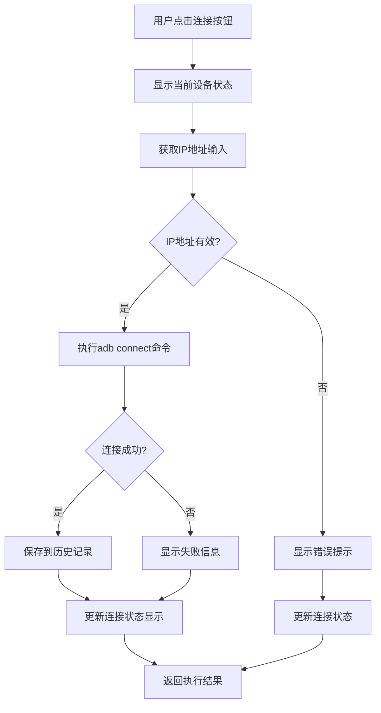
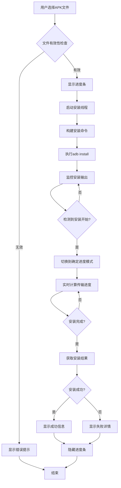
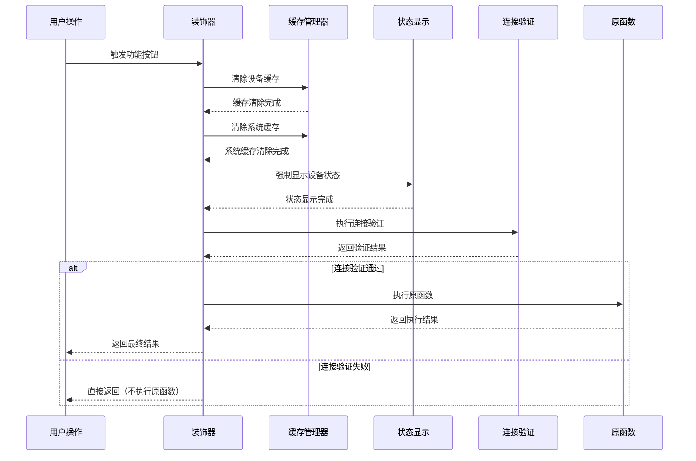

# ADB工具功能点执行逻辑详解

## 🎯 核心功能模块执行流程

### 1. 设备管理功能

#### 1.1 设备连接 (connect_adb)
```python
@require_device_connected
def connect_adb(self):
    """连接ADB设备 - 完整执行流程"""
    # 1. 显示当前设备状态
    self.show_current_device_status()
    
    # 2. 获取并验证IP地址
    ip_address = self.get_ip_address()
    if not ip_address:
        self.update_status("请输入IP地址", False)
        self.update_connection_status()
        return False
    
    # 3. 执行连接命令
    output, success = self.run_adb_with_target(f"adb connect {ip_address}")
    
    # 4. 处理连接结果
    if "connected" in output.lower():
        # 4.1 保存到历史记录
        if ip_address not in self.ip_history:
            self.ip_history.insert(0, ip_address)
            save_ip_history(self.ip_history)
            if hasattr(self, 'ip_combobox'):
                self.ip_combobox['values'] = self.ip_history
        
        # 4.2 更新状态显示
        self.update_status(output, True)
        self.update_connection_status(ip_address)
        return True
    else:
        # 4.3 连接失败处理
        self.update_status(output, False)
        self.update_connection_status(ip_address)
        return False
```

**执行逻辑图：**


#### 1.2 设备断开 (disconnect_adb)
```python
@require_device_connected
def disconnect_adb(self):
    """断开ADB连接 - 执行逻辑"""
    # 1. 强制显示当前设备状态（装饰器触发）
    # 2. 执行断开命令
    output, success = self.run_adb_with_target("adb disconnect")
    
    # 3. 处理断开结果
    if "disconnected" in output.lower():
        self.update_status(output, True)
    else:
        self.update_status(output, False)
    
    # 4. 更新连接状态显示
    self.update_connection_status()
```

#### 1.3 设备状态检查 (check_device_connected)
```python
def check_device_connected(self, ip_address: Optional[str] = None) -> bool:
    """检查设备连接状态 - 核心验证逻辑"""
    # 1. 获取目标IP地址
    if not ip_address:
        ip_address = self.get_ip_address()
    if not ip_address:
        return False
    
    # 2. 强制刷新设备列表（不清除缓存）
    output, success = run_adb_command("adb devices")
    if success:
        # 3. 解析设备列表
        devices = [line.split("\t")[0] for line in output.splitlines()[1:] 
                  if "device" in line]
        ip_with_port = f"{ip_address}:5555" if ip_address else None
        
        # 4. 精确匹配设备
        is_connected = False
        for device in devices:
            # 完全匹配
            if device == ip_address or device == ip_with_port:
                is_connected = True
                break
            # 前缀匹配（防止部分匹配错误）
            elif device.startswith(ip_address + ':'):
                is_connected = True
                break
        
        # 5. 更新缓存并返回结果
        cache_manager.set_device_status(ip_address, is_connected)
        return is_connected
    return False
```

### 2. 应用管理功能

#### 2.1 APK强制安装 (force_install)
```python
@require_device_connected
def force_install(self):
    """APK强制安装 - 完整执行流程"""
    # 1. 验证APK文件
    apk_path = self.apk_entry.get()
    if not apk_path:
        self.update_status("请选择APK文件", False)
        return
    
    # 2. 显示进度条并启动安装线程
    self._show_progress()
    self.update_status("开始安装应用...", True)
    
    install_thread = threading.Thread(
        target=self._run_install_with_progress,
        args=(apk_path,),
        daemon=True
    )
    install_thread.start()

def _run_install_with_progress(self, apk_path):
    """实际安装执行 - 核心逻辑"""
    try:
        # 1. 准备安装环境
        target_ip = self.get_ip_address()
        apk_size = os.path.getsize(apk_path)
        current_size = 0
        
        # 2. 构建安装命令
        install_cmd = f"adb install -r -d \"{apk_path}\""
        install_cmd = build_adb_command_with_device(install_cmd, target_ip)
        
        # 3. 启动安装进程
        process = subprocess.Popen(
            install_cmd,
            shell=True,
            stdout=subprocess.PIPE,
            stderr=subprocess.STDOUT,
            text=True
        )
        
        # 4. 实时监控安装过程
        filter_keywords = ["Performing Streamed Install"]
        installing_started = False
        full_output = []
        
        while True:
            output = process.stdout.readline()
            if output == '' and process.poll() is not None:
                break
            if output:
                full_output.append(output)
                stripped_output = output.strip()
                
                # 4.1 检测安装开始
                if "Performing Streamed Install" in stripped_output:
                    installing_started = True
                    self.app.progress["mode"] = "determinate"
                    self.app.progress["maximum"] = 100
                    self.app.progress["value"] = 0
                    current_size = 0
                    self._update_install_status("安装开始，正在传输数据...")
                    continue
                
                # 4.2 更新传输进度
                if installing_started:
                    current_size += len(output)
                    progress = min(95, int((current_size / apk_size) * 100))
                    self.app.progress["value"] = progress
                    
                    # 显示详细进度信息
                    transferred = format_file_size(current_size)
                    total = format_file_size(apk_size)
                    self._update_install_status(f"正在传输... {progress}% ({transferred} / {total})")
                    
                    # 4.3 检测安装结果
                    if "Success" in stripped_output:
                        self.app.progress["value"] = 100
                        self._update_install_status("安装成功")
                    elif "Failure" in stripped_output:
                        self._update_install_status(f"安装失败: {stripped_output}")
        
        # 5. 处理最终结果
        return_code = process.poll()
        success = return_code == 0
        
        # 6. 清理和结果显示
        self.app.progress["mode"] = "indeterminate"
        self.app._hide_progress()
        
        if success:
            file_size = format_file_size(os.path.getsize(apk_path))
            apk_name = os.path.basename(apk_path)
            self.app.update_status(f"安装完成\n文件: {apk_name}\n大小: {file_size}\n目标设备: {target_ip}", True)
        else:
            error_detail = "\n".join(full_output[-5:]) if full_output else "无输出"
            final_output = f"安装失败 (code {return_code})\n详细信息:\n{error_detail}"
            self._update_install_status(final_output)
            
    except Exception as e:
        self._update_install_status(f"安装过程出错: {str(e)}")
        self.app._hide_progress()
```

**安装流程图：**


#### 2.2 应用卸载 (uninstall)
```python
@require_device_connected
def uninstall(self):
    """应用卸载 - 带确认的安全执行"""
    # 1. 获取包名
    pkg_name = self.get_package_name_from_input()
    if not pkg_name:
        self.update_status("请输入包名", False)
        return
    
    # 2. 显示确认对话框
    result = messagebox.askyesno(
        "确认卸载",
        f"您确定要卸载应用吗？\n\n包名: {pkg_name}\n\n注意：卸载后应用数据将被永久删除。",
        icon="warning"
    )
    
    # 3. 处理用户选择
    if result:
        # 3.1 执行卸载命令
        output, success = self.run_adb_with_target(f"adb uninstall {pkg_name}")
        if success:
            # 3.2 清除相关缓存
            cache_manager.package_cache.delete(f"package_{pkg_name}")
        self.update_status(output, success)
    else:
        # 3.3 用户取消操作
        self.update_status("已取消卸载操作", True)
```

#### 2.3 应用列表获取 (package_list)
```python
@require_device_connected
def package_list(self):
    """获取已安装应用列表 - 并行处理优化"""
    try:
        # 1. 获取所有已安装包名
        output, success = self.run_adb_with_target("adb shell pm list packages")
        if not success:
            self.update_status("获取应用列表失败", False)
            return
        
        # 2. 解析包名列表
        packages = [line.replace("package:", "").strip() 
                   for line in output.splitlines() if line.strip()]
        
        if not packages:
            self.update_status("未找到已安装的应用", False)
            return
        
        # 3. 显示处理进度
        self.update_status(f"正在获取 {len(packages)} 个应用的版本信息...", True)
        
        # 4. 动态线程池并行处理
        max_workers = calculate_optimal_workers(len(packages))
        
        with concurrent.futures.ThreadPoolExecutor(max_workers=max_workers) as executor:
            # 4.1 提交所有版本查询任务
            future_to_package = {
                executor.submit(self.get_package_version, package): package 
                for package in packages
            }
            
            # 4.2 收集和显示结果
            processed_count = 0
            for future in concurrent.futures.as_completed(future_to_package):
                package = future_to_package[future]
                try:
                    version = future.result()
                    version_str = version if version else "未知"
                    self.status_text.insert(
                        tk.END, 
                        f"\n{package} (版本: {version_str})", 
                        "info"
                    )
                except Exception as e:
                    self.status_text.insert(
                        tk.END,
                        f"\n{package} (版本: 获取失败 - {str(e)})",
                        "error"
                    )
                
                # 4.3 显示处理进度
                processed_count += 1
                if processed_count % 10 == 0:
                    self.status_text.insert(
                        tk.END,
                        f"\n已处理 {processed_count}/{len(packages)} 个应用",
                        "info"
                    )
                
                self.status_text.see(tk.END)
        
        # 5. 显示完成状态
        self.update_status(f"\n获取应用列表完成，共 {len(packages)} 个应用", True)
        
    except Exception as e:
        self.update_status(f"获取应用列表时出错: {str(e)}", False)
```

### 3. 系统信息功能

#### 3.1 获取Android版本 (get_android_version)
```python
@require_device_connected
def get_android_version(self):
    """获取Android版本 - 缓存优化版本"""
    # 1. 检查缓存
    cached_version = cache_manager.get_system_info("android_version")
    if cached_version:
        self.update_status(f"Android版本: {cached_version}", True)
        return
    
    # 2. 执行系统命令获取版本
    output, success = self.run_adb_with_target("adb shell getprop ro.build.version.release")
    if success:
        version = output.strip()
        # 3. 更新缓存
        cache_manager.set_system_info("android_version", version)
        self.update_status(f"Android版本: {version}", True)
    else:
        self.update_status(output, False)
```

#### 3.2 获取设备序列号 (get_serial_number)
```python
@require_device_connected
def get_serial_number(self):
    """获取设备序列号 - 多策略获取"""
    # 1. 检查缓存
    cached_serial = cache_manager.get_system_info("serial_number")
    if cached_serial:
        self.update_status(f"设备序列号: {cached_serial}", True)
        return
    
    # 2. 使用工具函数获取（多策略）
    from utils import get_device_serial_number
    serial = get_device_serial_number()
    
    if serial:
        # 3. 更新缓存
        cache_manager.set_system_info("serial_number", serial)
        
        # 4. 根据结果类型提供不同提示
        if ':' in serial and serial.count('.') == 3:
            info_msg = f"设备标识: {serial} (网络连接)"
        elif len(serial) == 16 and all(c in '0123456789abcdefABCDEF' for c in serial):
            info_msg = f"设备标识: {serial} (Android ID)"
        else:
            info_msg = f"设备序列号: {serial}"
        
        self.update_status(f"{info_msg}\n-注：已优化获取策略，优先硬件串号。", True)
    else:
        self.update_status("无法获取设备序列号，请检查设备连接和权限。", False)
```

### 4. 日志管理功能

#### 4.1 启动日志捕获 (start_logcat)
```python
@require_device_connected
def start_logcat(self):
    """启动日志捕获 - 完整安全检查流程"""
    # 1. 状态检查（防止重复启动）
    if self.logging_active:
        self.update_status("日志捕获已在运行", False)
        return
    
    # 2. 设备连接二次验证
    if not self.check_device_connected():
        self.update_status("设备未连接，无法启动日志捕获", False)
        return
    
    # 3. 命令可用性测试
    test_output, test_success = self.run_adb_with_target("adb logcat -d -t 1")
    if not test_success:
        self.update_status(f"ADB logcat命令不可用: {test_output}", False)
        return
    
    # 4. 路径和权限验证
    user_log_path = self.log_path_entry.get().strip()
    if not user_log_path:
        user_log_path = self.default_log_path
        self.log_path_entry.delete(0, tk.END)
        self.log_path_entry.insert(0, user_log_path)
    
    try:
        # 4.1 创建目录
        os.makedirs(user_log_path, exist_ok=True)
        # 4.2 测试写入权限
        test_file = os.path.join(user_log_path, "test_write.tmp")
        with open(test_file, 'w', encoding='utf-8') as tf:
            tf.write("test")
        os.remove(test_file)
    except PermissionError:
        self.update_status("无权限写入该目录，请以管理员身份运行程序或选择其他目录", False)
        return
    except Exception as e:
        self.update_status(f"创建日志目录失败: {str(e)}", False)
        return
    
    # 5. 设置日志文件路径
    log_file_name = f"{timestamp_time()}.log"
    self.log_file_path = os.path.join(user_log_path, log_file_name)
    
    # 6. 防止文件覆盖
    counter = 1
    original_path = self.log_file_path
    while os.path.exists(self.log_file_path):
        base_name = os.path.splitext(original_path)[0]
        self.log_file_path = f"{base_name}_{counter}.log"
        counter += 1
        if counter > 100:
            self.update_status("无法创建唯一文件名", False)
            return
    
    # 7. 设置运行状态
    self.logging_active = True
    self.stop_event.clear()
    
    # 8. 显示启动信息
    self.update_status(f"正在启动日志捕获...\n目标文件: {self.log_file_path}", True)
    
    # 9. 启动日志线程
    try:
        self.logcat_thread = threading.Thread(
            target=self._run_logcat,
            name="LogcatThread",
            daemon=True
        )
        self.logcat_thread.start()
        
        # 10. 验证线程启动
        time.sleep(1)
        if self.logcat_thread.is_alive() and self.logging_active:
            self.update_status("日志捕获已成功启动！\n点击'停止日志捕获'结束捕获", True)
        else:
            self.update_status("日志捕获线程启动失败", False)
            self.logging_active = False
            
    except Exception as e:
        self.update_status(f"启动日志捕获线程失败: {str(e)}", False)
        self.logging_active = False
```

#### 4.2 停止日志捕获 (stop_logcat)
```python
@require_device_connected
def stop_logcat(self):
    """停止日志捕获 - 安全停止和文件处理"""
    # 1. 状态检查
    if not self.logging_active:
        self.update_status("没有正在运行的日志捕获", False)
        return
    
    # 2. 设置停止信号
    self.stop_event.set()
    self.update_status("正在停止日志捕获...", True)
    
    # 3. 确保进程终止
    self._terminate_logcat()
    
    # 4. 等待线程结束
    if hasattr(self, 'logcat_thread') and self.logcat_thread.is_alive():
        self.logcat_thread.join(timeout=5)
    
    # 5. 额外等待确保文件句柄释放
    time.sleep(2)
    
    # 6. 检查文件状态
    if not os.path.exists(self.log_file_path):
        self.update_status("日志文件不存在，可能捕获过程中出现错误", False)
        self.logging_active = False
        return
    
    # 7. 检查文件大小并给出相应提示
    file_size = os.path.getsize(self.log_file_path)
    if file_size == 0:
        self.update_status("警告：日志文件为空，可能原因：\n1. 设备无日志输出\n2. ADB连接不稳定\n3. 权限不足\n4. 捕获时间过短", False)
    else:
        file_size_str = format_file_size(file_size)
        self.update_status(f"日志捕获成功，文件大小: {file_size_str}", True)
    
    # 8. 文件重命名处理
    original_path = os.path.dirname(self.log_file_path)
    stop_timestamp = timestamp_time()
    if file_size == 0:
        new_name = os.path.join(original_path, f"{stop_timestamp}_empty.log")
    else:
        new_name = os.path.join(original_path, f"{stop_timestamp}.log")
    
    # 9. 重试机制确保文件保存
    max_retries = 5
    success_save = False
    last_error = ""
    
    for attempt in range(max_retries):
        try:
            # 9.1 检查文件是否被占用
            try:
                with open(self.log_file_path, 'r+b') as test_file:
                    pass
            except IOError:
                self.update_status(f"文件仍被占用，等待释放... (尝试 {attempt + 1}/{max_retries})", True)
                time.sleep(2)
                continue
            
            # 9.2 执行重命名
            os.rename(self.log_file_path, new_name)
            success_save = True
            
            # 9.3 显示成功信息
            save_path = os.path.abspath(new_name)
            if file_size == 0:
                self.update_status(f"日志捕获已停止\n空日志文件已保存到: {save_path}\n建议检查设备连接和权限设置", False)
            else:
                self.update_status(f"日志捕获已停止\n日志文件已保存到: {save_path}", True)
            
            # 9.4 尝试打开文件夹
            try:
                os.startfile(os.path.dirname(new_name))
            except:
                pass
            break
            
        except PermissionError as e:
            last_error = f"权限错误: {str(e)}"
            if attempt < max_retries - 1:
                self.update_status(f"文件被占用，等待释放... (尝试 {attempt + 1}/{max_retries})", True)
                time.sleep(2)
                continue
        except Exception as e:
            last_error = f"重命名失败: {str(e)}"
            self.update_status(f"保存日志文件失败: {str(e)}", False)
            break
    
    # 10. 重置状态
    self.logging_active = False
    
    # 11. 处理保存失败情况
    if not success_save:
        file_size_str = format_file_size(file_size) if file_size > 0 else "空文件"
        self.update_status(f"日志捕获已停止，但文件保存失败。\n原因: {last_error}\n原文件位置: {self.log_file_path}\n文件大小: {file_size_str}", False)
    
    # 12. 清理进程引用
    self.logcat_subprocess = None
```

### 5. 屏幕操作功能

#### 5.1 屏幕截图 (screencap)
```python
@require_device_connected
def screencap(self):
    """屏幕截图 - 优化版执行逻辑"""
    try:
        # 1. 显示提示信息并强制更新界面
        self.update_status("正在截图，请稍候...", True)
        self.root.update()
        time.sleep(0.5)  # 确保提示信息显示
        
        # 2. 清理可能存在的旧截图
        self.run_adb_with_target("adb shell rm -f /sdcard/screenshot.png")
        
        # 3. 设置保存路径
        from utils import get_user_defined_log_path
        user_log_path = get_user_defined_log_path(self)
        save_dir = ensure_directory(os.path.join(user_log_path, "screenshots"))
        new_file = get_next_filename(os.path.join(save_dir, "截图"), ".png")
        
        # 4. 多次尝试截图（提高成功率）
        max_retries = Config.MAX_INSTALL_RETRIES
        success = False
        error_msg = ""
        
        for attempt in range(max_retries):
            # 4.1 执行截图
            output1, success1 = self.run_adb_with_target("adb shell screencap -p /sdcard/screenshot.png")
            if not success1:
                error_msg = output1
                time.sleep(1)
                continue
            
            # 4.2 验证文件生成
            output2, success2 = self.run_adb_with_target("adb shell ls -l /sdcard/screenshot.png")
            if not success2 or "No such file" in output2:
                error_msg = "截图文件未生成"
                time.sleep(1)
                continue
            
            # 4.3 拉取文件到本地
            output3, success3 = self.run_adb_with_target(f"adb pull /sdcard/screenshot.png {new_file}")
            if not success3:
                error_msg = output3
                time.sleep(1)
                continue
            
            # 4.4 验证本地文件
            if os.path.exists(new_file):
                file_size = os.path.getsize(new_file)
                if file_size > 0:
                    success = True
                    break
                else:
                    error_msg = "生成的截图文件为空"
            else:
                error_msg = "本地文件保存失败"
            time.sleep(1)
        
        # 5. 清理设备临时文件
        self.run_adb_with_target("adb shell rm -f /sdcard/screenshot.png")
        
        # 6. 显示结果
        if success:
            file_size = format_file_size(os.path.getsize(new_file))
            self.update_status(f"截图已保存至路径: {new_file}\n文件大小: {file_size}", True)
            # 尝试打开截图所在文件夹
            try:
                os.startfile(os.path.dirname(new_file))
            except:
                pass
        else:
            self.update_status(f"截图失败: {error_msg}", False)
            
    except Exception as e:
        self.update_status(f"截图过程出错: {str(e)}", False)
```

#### 5.2 屏幕录制 (start_recording/stop_recording)
```python
@require_device_connected
def start_recording(self):
    """开始屏幕录制 - 完整流程"""
    # 1. 状态检查
    if self.recording_active:
        self.update_status("屏幕录制已在进行中", False)
        return
    
    # 2. 设备连接验证
    if not self.check_device_connected():
        self.update_status("设备未连接，无法开始录制", False)
        return
    
    # 3. 命令可用性测试
    test_output, test_success = self.run_adb_with_target("adb shell screenrecord --help")
    if not test_success:
        self.update_status(f"ADB screenrecord命令不可用: {test_output}", False)
        return
    
    # 4. 路径设置和权限检查
    user_log_path = self.log_path_entry.get().strip()
    if not user_log_path:
        user_log_path = self.default_log_path
        self.log_path_entry.delete(0, tk.END)
        self.log_path_entry.insert(0, user_log_path)
    
    try:
        os.makedirs(user_log_path, exist_ok=True)
        test_file = os.path.join(user_log_path, "test_write.tmp")
        with open(test_file, 'w', encoding='utf-8') as tf:
            tf.write("test")
        os.remove(test_file)
    except PermissionError:
        self.update_status("无权限写入该目录，请以管理员身份运行程序或选择其他目录", False)
        return
    except Exception as e:
        self.update_status(f"创建录制目录失败: {str(e)}", False)
        return
    
    # 5. 设置录制文件路径
    recording_file_name = f"temp_rec_{timestamp_time()}.mp4"
    self.recording_file_path = os.path.join(user_log_path, recording_file_name)
    
    # 6. 设置状态
    self.recording_active = True
    
    # 7. 显示启动信息
    self.update_status(f"正在开始屏幕录制...\n目标文件: {self.recording_file_path}", True)
    
    # 8. 启动录制线程
    try:
        self.recording_thread = threading.Thread(
            target=self._run_recording,
            name="RecordingThread",
            daemon=True
        )
        self.recording_thread.start()
        
        time.sleep(1)
        
        if self.recording_thread.is_alive() and self.recording_active:
            self.update_status("屏幕录制已成功启动！\n点击'停止录制'结束录制", True)
        else:
            self.update_status("录制线程启动失败", False)
            self.recording_active = False
            
    except Exception as e:
        self.update_status(f"启动录制线程时出错: {str(e)}", False)
        self.recording_active = False

def stop_recording(self):
    """停止屏幕录制 - 安全停止流程"""
    # 1. 状态检查
    if not self.recording_active:
        self.update_status("没有正在进行的录制", False)
        return
    
    # 2. 显示停止信息
    self.update_status("正在停止屏幕录制...", True)
    self.recording_active = False
    
    # 3. 终止录制进程
    if self.recording_subprocess and self.recording_subprocess.poll() is None:
        try:
            self.recording_subprocess.terminate()
            self.recording_subprocess.wait(timeout=3)
        except subprocess.TimeoutExpired:
            # 强制终止
            try:
                self.recording_subprocess.kill()
                self.recording_subprocess.wait(timeout=2)
            except:
                pass
        except Exception:
            pass
    
    # 4. 等待录制线程结束
    if self.recording_thread and self.recording_thread.is_alive():
        self.recording_thread.join(timeout=10)
        if self.recording_thread.is_alive():
            self.update_status("警告：录制线程仍在运行，可能正在处理文件操作...", False)
    
    # 5. 重置状态
    self.recording_active = False
    self.recording_subprocess = None
    
    self.update_status("录制停止操作完成", True)
```

## 🔄 装饰器执行逻辑

### @require_device_connected 装饰器详解

```python
def require_device_connected(func):
    """设备连接校验装饰器 - 执行流程"""
    def wrapper(self):
        # 1. 强制刷新设备状态显示（装饰器核心功能）
        if hasattr(self, 'show_current_device_status'):
            # 1.1 清除所有相关缓存确保数据新鲜度
            from cache_manager import cache_manager
            cache_manager.device_cache.clear()
            cache_manager.system_cache.clear()
            
            # 1.2 强制显示当前设备状态
            self.show_current_device_status(force_display=True, decorator_call=True)
        
        # 2. 执行设备连接验证
        if not self.ensure_device_connected():
            return  # 验证失败直接返回，不执行原函数
        
        # 3. 验证通过，执行原函数
        return func(self)
    return wrapper
```

**装饰器执行时序图：**


## 📊 错误处理机制

### 1. 多层错误拦截
```python
# 第一层：装饰器级别错误处理
@require_device_connected
def some_function(self):
    try:
        # 第二层：函数级别错误处理
        result = self.some_operation()
        return result
    except SpecificException as e:
        # 第三层：具体异常处理
        self.handle_specific_error(e)
        return None
    except Exception as e:
        # 第四层：通用异常处理
        self.handle_generic_error(e)
        return None
```

### 2. 重试机制实现
```python
def run_adb_command_with_retry(command, max_retries=3, timeout=30):
    """带重试机制的命令执行"""
    last_error = ""
    
    for attempt in range(max_retries):
        try:
            result = subprocess.run(
                command,
                shell=True,
                check=True,
                stdout=subprocess.PIPE,
                stderr=subprocess.PIPE,
                timeout=timeout
            )
            return result.stdout.decode('utf-8', errors='ignore'), True
            
        except subprocess.TimeoutExpired:
            last_error = f"命令超时 (第{attempt + 1}次尝试)"
            if attempt < max_retries - 1:
                time.sleep(2 ** attempt)  # 指数退避
                continue
                
        except subprocess.CalledProcessError as e:
            last_error = f"命令执行失败，返回码: {e.returncode}"
            if attempt < max_retries - 1:
                time.sleep(1)
                continue
    
    return last_error, False
```

这份详细的执行逻辑文档展示了每个核心功能的具体实现步骤和处理流程，为开发者理解和维护代码提供了完整的参考。