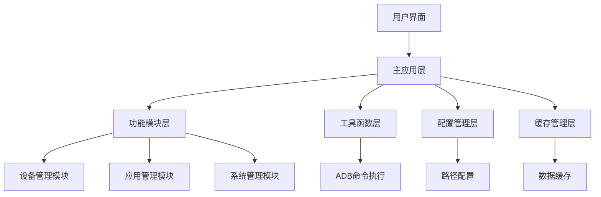
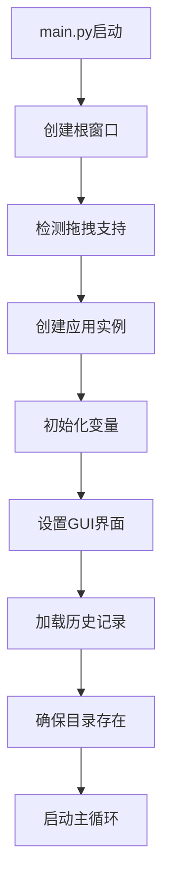
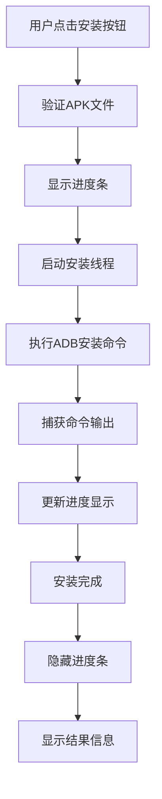

# ADB Tool - Android设备管理工具（详细版）

一个基于Python Tkinter的Android设备管理工具，提供了丰富的ADB操作功能，支持应用安装、设备管理、日志捕获、屏幕录制等多种功能。

## 📋 目录

- [项目概述](#项目概述)
- [系统架构](#系统架构)
- [核心功能详解](#核心功能详解)
  - [设备管理](#设备管理)
  - [应用管理](#应用管理)
  - [日志功能](#日志功能)
  - [屏幕录制](#屏幕录制)
  - [屏幕截图](#屏幕截图)
  - [系统功能](#系统功能)
- [运行调用逻辑](#运行调用逻辑)
- [模块设计](#模块设计)
- [技术实现](#技术实现)
- [快速开始](#快速开始)
- [使用说明](#使用说明)
- [文件结构](#文件结构)
- [高级功能](#高级功能)
- [故障排除](#故障排除)
- [更新日志](#更新日志)

## 项目概述

ADB Tool是一个功能完整的Android设备管理工具，旨在简化Android开发和测试过程。该工具通过图形化界面提供便捷的ADB操作功能，支持多种设备连接方式和丰富的设备管理功能。

### 核心价值
- **简化操作**：将复杂的ADB命令封装为直观的图形界面操作
- **提高效率**：批量处理和自动化功能大幅提升工作效率
- **降低门槛**：无需记忆复杂命令，新手也能快速上手
- **增强功能**：提供原生ADB不支持的高级功能

## 系统架构

### 整体架构图


### 调用关系
1. **用户操作** → **GUI界面** → **主应用** → **功能模块** → **工具函数** → **ADB命令**
2. **数据流向**：工具函数 → 缓存管理 → 主应用 → GUI界面 → 用户

## 核心功能详解

### 设备管理

#### 连接管理
- **USB连接**：通过USB线连接Android设备
- **网络连接**：支持无线ADB连接，输入设备IP地址即可连接
- **多设备支持**：可同时管理多个连接的设备
- **连接状态监控**：实时检测设备连接状态

#### 设备信息
- **Android版本**：获取设备的Android系统版本号
- **设备序列号**：获取设备唯一标识（优先硬件串号）
- **设备列表**：显示所有已连接的设备

#### 权限管理
- **Root权限**：尝试获取设备的Root权限
- **重新挂载**：重新挂载系统分区以支持写入操作

### 应用管理

#### APK安装
- **强制安装**：使用`adb install -r -d`命令强制安装APK
- **拖拽安装**：支持直接拖拽APK文件到输入框进行安装
- **进度显示**：实时显示安装进度和传输速率
- **错误处理**：智能重试机制和详细的错误信息

#### 应用卸载
- **包名卸载**：根据输入的包名卸载应用
- **确认机制**：卸载前显示确认对话框防止误操作
- **缓存清理**：卸载后自动清理相关缓存

#### 应用列表
- **包名获取**：获取设备上所有已安装应用的包名
- **版本信息**：并行获取每个应用的版本号
- **导出功能**：将应用列表导出为CSV表格文件
- **智能缓存**：缓存应用信息提升响应速度

#### 应用信息
- **版本查询**：获取指定应用的版本号（智能选择最优版本）
- **安装路径**：获取应用的安装路径信息
- **前台应用**：自动获取当前运行的应用包名

#### 进程管理
- **进程终止**：强制停止指定应用的所有进程
- **批量操作**：支持对多个应用进行批量管理

### 日志功能

#### 实时日志
- **日志捕获**：启动和停止logcat日志抓取
- **文件命名**：以终止时间自动命名日志文件
- **路径管理**：支持自定义日志存储路径
- **自动下载**：日志文件自动保存到本地

#### 日志清理
- **缓存清除**：清除设备上的日志缓存
- **空间释放**：释放设备存储空间

### 屏幕录制

#### 录制功能
- **高清录制**：支持720p分辨率屏幕录制
- **智能命名**：录制文件以终止时间命名（MMDD-HHMMSS_video.mp4）
- **自动下载**：录制完成后自动从设备下载到本地
- **格式支持**：MP4格式，兼容性好

#### 录制管理
- **开始/停止**：便捷的录制控制
- **状态监控**：实时显示录制状态
- **文件管理**：自动打开录制文件所在目录

### 屏幕截图

#### 截图功能
- **一键截图**：快速截取当前屏幕
- **自动保存**：截图自动保存到指定目录
- **文件命名**：以时间戳命名截图文件
- **路径跟随**：截图保存路径跟随日志存储路径设置

#### 截图管理
- **批量处理**：支持连续截图
- **文件查看**：自动打开截图文件所在目录

### 系统功能

#### 设备控制
- **设备重启**：安全重启Android设备
- **ANR导出**：导出ANR（应用无响应）文件用于分析
- **命令查看**：查看每个功能对应的原始ADB命令

#### 系统信息
- **版本获取**：获取Android系统版本信息
- **序列号查询**：获取设备唯一标识
- **存储管理**：清理系统缓存释放存储空间

## 运行调用逻辑

### 程序启动流程


### 功能调用流程（以安装APK为例）


### 数据流向
1. **输入层**：用户通过GUI界面输入参数
2. **处理层**：主应用调用相应功能模块处理
3. **执行层**：工具函数执行ADB命令
4. **缓存层**：结果数据缓存到缓存管理器
5. **输出层**：结果显示在GUI界面

## 模块设计

### 主应用模块 (app.py)
- **核心控制器**：协调各功能模块工作
- **GUI管理**：管理用户界面组件和交互
- **状态管理**：维护应用运行状态
- **历史记录**：管理IP和包名历史记录

### 功能模块

#### 设备管理模块 (modules/device_manager.py)
```python
class DeviceManager:
    def connect_adb(self) -> bool:  # 连接设备
    def disconnect_adb(self) -> bool:  # 断开连接
    def check_device_connected(self) -> bool:  # 检查连接状态
    def get_device_list(self) -> Tuple[list, bool]:  # 获取设备列表
```

#### 应用管理模块 (modules/app_manager.py)
```python
class AppManager:
    def force_install(self) -> None:  # 强制安装
    def uninstall(self) -> bool:  # 卸载应用
    def package_list(self) -> None:  # 获取应用列表
    def get_package_version(self, package_name: str) -> Optional[str]:  # 获取版本
```

#### 系统管理模块 (modules/system_manager.py)
```python
class SystemManager:
    def get_android_version(self) -> Optional[str]:  # 获取Android版本
    def get_serial_number(self) -> Optional[str]:  # 获取设备序列号
    def screencap(self) -> bool:  # 屏幕截图
    def pull_anr_file(self) -> bool:  # 导出ANR文件
```

### GUI模块

#### 布局基类 (gui/layout_base.py)
- **界面构建**：创建主窗口和组件布局
- **样式管理**：统一界面样式和交互效果
- **事件绑定**：处理用户交互事件

#### 中文布局 (gui/layout_zh.py)
- **本地化支持**：提供中文界面布局
- **组件配置**：配置中文界面组件

### 工具模块

#### 配置管理 (config.py)
- **参数配置**：统一管理系统配置参数
- **路径管理**：管理默认存储路径
- **界面文本**：管理界面显示文本

#### 缓存管理 (cache_manager.py)
```python
class CacheManager:
    def get_device_status(self, device_id: str) -> Optional[bool]:  # 获取设备状态
    def set_device_status(self, device_id: str, status: bool) -> None:  # 设置设备状态
    def get_package_info(self, package_name: str) -> Optional[Dict[str, Any]]:  # 获取包信息
    def set_package_info(self, package_name: str, info: Dict[str, Any]) -> None:  # 设置包信息
```

#### 工具函数 (utils.py)
```python
def run_adb_command(command: str, retries: int = None, timeout: int = None) -> Tuple[str, bool]:  # 执行ADB命令
def timestamp_time() -> str:  # 生成时间戳
def extract_version_info(output: str) -> Optional[str]:  # 提取版本信息
def get_device_serial_number() -> Optional[str]:  # 获取设备序列号
```

### 装饰器模块 (decorators.py)
```python
def require_device_connected(func):  # 设备连接校验装饰器
```

## 技术实现

### 核心技术栈
- **Python 3.7+**：主要开发语言
- **Tkinter**：图形界面框架
- **Subprocess**：执行ADB命令
- **Threading**：多线程处理
- **Concurrent**：并发处理优化

### 关键实现细节

#### 1. ADB命令执行
```python
def run_adb_command(command: str, retries: int = None, timeout: int = None) -> Tuple[str, bool]:
    # 重试机制
    # 超时控制
    # 错误处理
    # 编码兼容
```

#### 2. 进度显示
- **确定性进度条**：根据文件传输大小计算进度
- **实时速率计算**：动态显示传输速率
- **状态更新**：同步显示安装状态信息

#### 3. 缓存机制
- **LRU算法**：最近最少使用缓存淘汰策略
- **多级缓存**：设备状态、应用信息、系统信息分别缓存
- **过期清理**：定期清理过期缓存项

#### 4. 拖拽支持
- **文件验证**：自动验证拖拽文件格式
- **视觉反馈**：拖拽时提供颜色变化反馈
- **格式处理**：自动处理文件路径格式

#### 5. 多线程处理
- **安装线程**：后台执行安装操作
- **录制线程**：后台执行屏幕录制
- **日志线程**：后台执行日志捕获

## 快速开始

### 环境要求
- **Python 3.7+**
- **Android SDK Platform Tools (ADB)**
- **Windows/Linux/macOS**

### 安装依赖
```bash
pip install tkinter
pip install psutil
```

### 可选依赖（拖拽功能）
```bash
pip install tkinterdnd2
```

### 运行程序
```bash
python main.py
```

## 使用说明

### 设备连接
1. **USB连接**：直接连接设备，点击"连接 ADB"
2. **网络连接**：
   - 在IP地址框输入设备IP地址
   - 点击"连接 ADB"进行无线连接

### 应用安装
1. **浏览选择**：点击"选择安装包路径"选择APK文件
2. **拖拽安装**：直接将APK文件拖拽到输入框
3. **强制安装**：点击"强制安装apk"执行安装

### 日志捕获
1. 设置日志存储路径（可选）
2. 点击"启动日志捕获"开始抓取
3. 进行需要记录的操作
4. 点击"停止日志捕获"结束并保存

### 屏幕录制
1. 确保设备支持screenrecord命令（Android 4.4+）
2. 点击"开始屏幕录制"启动录制
3. 在设备上执行需要录制的操作
4. 点击"停止屏幕录制"结束录制
5. 录制文件会自动下载并打开所在文件夹

## 文件结构

```
ADB_Tool/
├── main.py                 # 主程序入口
├── app.py                 # 应用主逻辑
├── config.py              # 配置文件
├── utils.py               # 工具函数
├── cache_manager.py       # 缓存管理
├── decorators.py          # 装饰器
├── gui/                   # GUI界面模块
│   ├── layout_base.py     # 基础布局
│   └── layout_zh.py       # 中文界面布局
├── modules/               # 功能模块
│   ├── app_manager.py     # 应用管理
│   ├── device_manager.py  # 设备管理
│   └── system_manager.py  # 系统管理
├── ip_history.txt         # IP历史记录
├── pkg_history.txt        # 包名历史记录
└── README.md             # 说明文档
```

## 高级功能

### 历史记录
- **IP地址历史**：自动保存连接过的IP地址
- **包名历史**：自动保存使用过的包名
- **智能补全**：下拉框支持历史记录选择

### 拖拽支持
- **APK拖拽**：支持直接拖拽APK文件到输入框
- **文件验证**：自动验证拖拽文件格式
- **视觉反馈**：拖拽时提供颜色变化反馈

### 错误处理
- **连接检测**：自动检测设备连接状态
- **错误重试**：智能重试机制
- **详细日志**：提供详细的错误信息

### 性能优化
- **缓存机制**：缓存常用信息提升响应速度
- **并发处理**：支持多线程操作
- **内存管理**：优化内存使用

## 故障排除

### 常见问题

**设备连接失败**
- 确保ADB驱动已正确安装
- 检查USB调试是否已开启
- 尝试重新连接USB线

**应用安装失败**
- 检查APK文件是否完整
- 确认设备存储空间充足
- 尝试使用强制安装选项

**日志捕获为空**
- 检查设备连接稳定性
- 确认日志权限设置
- 尝试清除日志缓存后重新捕获

**屏幕录制不工作**
- 确保Android版本4.4+
- 检查设备是否支持screenrecord
- 某些功能可能需要Root权限

## 更新日志

### 版本特性
- ✅ 完整的ADB设备管理功能
- ✅ 用户友好的图形界面
- ✅ 智能文件命名和管理
- ✅ 拖拽安装支持
- ✅ 历史记录功能
- ✅ 屏幕录制和截图
- ✅ 多设备连接支持
- ✅ 错误处理和重试机制

### 技术优化
- 🔧 模块化代码结构
- 🔧 统一配置管理
- 🔧 缓存机制优化
- 🔧 GUI布局优化
- 🔧 错误处理增强
- 🔧 性能提升优化

## 贡献

欢迎提交Issue和Pull Request来帮助改进这个项目。

## 许可证

本项目采用MIT许可证，详情请查看LICENSE文件。

## 支持

如果你觉得这个工具有用，请给项目点个星！⭐

---

**ADB Tool** - 让Android开发和测试更简单高效！