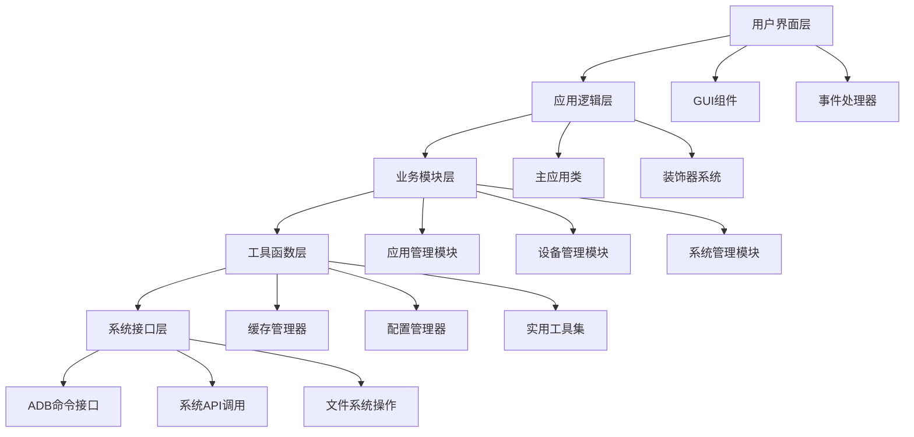

# ADB工具技术架构深度解析

## 🏗️ 系统架构概览

### 整体架构图


## 🎯 核心设计模式应用

### 1. 装饰器模式 (@require_device_connected)
```python
# 设备连接前置检查装饰器
def require_device_connected(func):
    def wrapper(self):
        # 缓存清除确保状态新鲜度
        cache_manager.device_cache.clear()
        cache_manager.system_cache.clear()
        
        # 强制状态显示
        self.show_current_device_status(force_display=True, decorator_call=True)
        
        # 连接验证
        if not self.ensure_device_connected():
            return
            
        # 执行原函数
        return func(self)
    return wrapper
```

### 2. 观察者模式 (事件驱动)
```python
# IP地址变更事件处理
def on_ip_changed(self, event=None):
    # 立即更新连接状态
    self.update_connection_status()
    
    # 根据事件类型决定显示策略
    if event and event.type == 'VirtualEvent' and event.name == 'ComboboxSelected':
        self.show_current_device_status(force_display=True)
    else:
        self.show_current_device_status(force_display=True)
```

### 3. 单例模式 (缓存管理)
```python
class CacheManager:
    _instance = None
    
    def __new__(cls):
        if cls._instance is None:
            cls._instance = super().__new__(cls)
            cls._instance._initialized = False
        return cls._instance
    
    def __init__(self):
        if not self._initialized:
            self.device_cache = TTLCache(maxsize=100, ttl=30)
            self.package_cache = TTLCache(maxsize=500, ttl=60)
            self.system_cache = TTLCache(maxsize=50, ttl=120)
            self._initialized = True
```

### 4. 策略模式 (设备连接策略)
```python
# 多种设备连接验证策略
class DeviceConnectionStrategy:
    @staticmethod
    def validate_usb_connection(device_id):
        """USB连接验证策略"""
        return device_id and ':' not in device_id
    
    @staticmethod
    def validate_network_connection(device_id):
        """网络连接验证策略"""
        return device_id and ':' in device_id and device_id.count('.') == 3
    
    @staticmethod
    def validate_accessibility(device_id):
        """设备可达性验证策略"""
        try:
            result = subprocess.run(
                f"adb -s {device_id} shell echo test",
                shell=True, timeout=3,
                stdout=subprocess.PIPE, stderr=subprocess.PIPE
            )
            return result.returncode == 0
        except:
            return False
```

## 🔧 关键技术实现详解

### 1. 多设备支持机制

#### 设备识别算法
```python
def get_connected_devices(self) -> List[str]:
    """智能设备识别与验证"""
    try:
        # 1. 获取原始设备列表
        result = subprocess.run(
            "adb devices", shell=True, check=True,
            stdout=subprocess.PIPE, stderr=subprocess.PIPE,
            timeout=5
        )
        output = result.stdout.decode('utf-8', errors='ignore')
        
        devices = []
        for line in output.splitlines()[1:]:  # 跳过标题行
            if '\t' in line and 'device' in line:
                device_id = line.split('\t')[0].strip()
                
                # 2. 多层次验证
                if (device_id and device_id != 'List' and 
                    'unauthorized' not in line and 'offline' not in line):
                    
                    # 3. 可达性验证
                    if self._validate_device_accessibility(device_id):
                        devices.append(device_id)
        
        return devices
    except Exception as e:
        logger.error(f"设备检测失败: {e}")
        return []

def _validate_device_accessibility(self, device_id: str) -> bool:
    """设备可达性验证"""
    try:
        validation_result = subprocess.run(
            f"adb -s {device_id} shell echo test",
            shell=True,
            stdout=subprocess.PIPE,
            stderr=subprocess.PIPE,
            timeout=3
        )
        return validation_result.returncode == 0
    except Exception:
        return False
```

#### 命令定向执行
```python
def build_adb_command_with_device(command: str, target_ip: Optional[str] = None) -> str:
    """智能命令路由与设备定向"""
    # 1. 避免重复处理
    if ' -s ' in command:
        return command
    
    # 2. 获取当前设备列表
    devices = get_connected_devices()
    
    # 3. 单设备优化
    if len(devices) <= 1:
        return command
    
    # 4. 多设备处理
    if target_ip:
        target_ip = target_ip.strip().strip('"').strip("'")
        
        # 5. IP地址标准化
        if ':' not in target_ip:
            target_ip_with_port = f"{target_ip}:5555"
        else:
            target_ip_with_port = target_ip
        
        # 6. 精确设备匹配
        matched_device = None
        for device in devices:
            # 完全匹配（包括端口号）
            if device == target_ip_with_port or device == target_ip:
                matched_device = device
                break
            # 前缀匹配（防止部分匹配错误）
            elif device.startswith(target_ip + ':'):
                matched_device = device
                break
        
        # 7. 插入设备参数
        if matched_device:
            if command.startswith('adb '):
                return command.replace('adb ', f'adb -s {matched_device} ', 1)
            elif command.startswith('adb'):
                return f'adb -s {matched_device} {command[3:]}'
    
    # 8. 默认行为回退
    return command
```

### 2. 缓存系统优化

#### 分级缓存策略
```python
class CacheManager:
    def __init__(self):
        # 短期缓存：频繁变化的数据
        self.device_cache = TTLCache(maxsize=100, ttl=30)    # 30秒过期
        
        # 中期缓存：相对稳定的数据
        self.package_cache = TTLCache(maxsize=500, ttl=60)   # 60秒过期
        
        # 长期缓存：很少变化的数据
        self.system_cache = TTLCache(maxsize=50, ttl=120)    # 120秒过期
        
        # 缓存统计信息
        self.stats = {
            'device_cache': {'hits': 0, 'misses': 0},
            'package_cache': {'hits': 0, 'misses': 0},
            'system_cache': {'hits': 0, 'misses': 0}
        }

    def get_package_info(self, package_name: str) -> Optional[Dict]:
        """包信息缓存访问 - 带统计"""
        cache_key = f"package_{package_name}"
        
        # 检查缓存命中
        if cache_key in self.package_cache:
            self.stats['package_cache']['hits'] += 1
            return self.package_cache[cache_key]
        else:
            self.stats['package_cache']['misses'] += 1
            return None

    def set_package_info(self, package_name: str, info: Dict) -> None:
        """包信息缓存更新"""
        cache_key = f"package_{package_name}"
        self.package_cache[cache_key] = info

    def get_all_stats(self) -> Dict:
        """获取所有缓存统计信息"""
        return {
            'device_cache': {
                'size': len(self.device_cache),
                'max_size': self.device_cache.maxsize,
                'timeout': self.device_cache.ttl,
                'hits': self.stats['device_cache']['hits'],
                'misses': self.stats['device_cache']['misses']
            },
            'package_cache': {
                'size': len(self.package_cache),
                'max_size': self.package_cache.maxsize,
                'timeout': self.package_cache.ttl,
                'hits': self.stats['package_cache']['hits'],
                'misses': self.stats['package_cache']['misses']
            },
            'system_cache': {
                'size': len(self.system_cache),
                'max_size': self.system_cache.maxsize,
                'timeout': self.system_cache.ttl,
                'hits': self.stats['system_cache']['hits'],
                'misses': self.stats['system_cache']['misses']
            }
        }
```

### 3. 异步任务处理

#### 线程池优化
```python
def calculate_optimal_workers(task_count: int) -> int:
    """动态计算最优工作线程数"""
    cpu_count = os.cpu_count() or 1
    
    # 根据任务数量和CPU核心数动态调整
    if task_count <= 10:
        return min(4, cpu_count)
    elif task_count <= 100:
        return min(8, cpu_count * 2)
    else:
        return min(16, cpu_count * 4)

def package_list_parallel(self):
    """并行包列表获取优化"""
    try:
        # 1. 获取包列表
        output, success = self.run_adb_with_target("adb shell pm list packages")
        if not success:
            return
            
        packages = [line.replace("package:", "").strip() 
                   for line in output.splitlines() if line.strip()]
        
        if not packages:
            return
            
        # 2. 动态线程池配置
        max_workers = calculate_optimal_workers(len(packages))
        
        # 3. 并行处理
        with concurrent.futures.ThreadPoolExecutor(max_workers=max_workers) as executor:
            # 提交所有任务
            future_to_package = {
                executor.submit(self._get_single_package_info, package): package 
                for package in packages
            }
            
            # 收集结果
            results = {}
            completed = 0
            
            for future in concurrent.futures.as_completed(future_to_package):
                package = future_to_package[future]
                try:
                    result = future.result(timeout=10)  # 10秒超时
                    results[package] = result
                except concurrent.futures.TimeoutError:
                    results[package] = {"error": "获取超时"}
                except Exception as e:
                    results[package] = {"error": str(e)}
                
                completed += 1
                # 进度更新
                if completed % 10 == 0:
                    progress = (completed / len(packages)) * 100
                    self.update_status(f"处理进度: {progress:.1f}% ({completed}/{len(packages)})", True)
        
        # 4. 结果处理和显示
        self._display_package_results(results)
        
    except Exception as e:
        self.update_status(f"并行处理出错: {str(e)}", False)

def _get_single_package_info(self, package_name: str) -> Dict:
    """单个包信息获取 - 缓存优化"""
    # 1. 检查缓存
    cached_info = cache_manager.get_package_info(package_name)
    if cached_info:
        return cached_info
    
    # 2. 实际获取
    try:
        version = get_accurate_package_version(package_name)
        info = {
            'name': package_name,
            'version': version,
            'timestamp': time.time()
        }
        
        # 3. 更新缓存
        cache_manager.set_package_info(package_name, info)
        return info
        
    except Exception as e:
        return {'name': package_name, 'error': str(e)}
```

### 4. 资源管理与清理

#### 安全进程终止
```python
def _terminate_process_safely(self, process, timeout=5):
    """安全进程终止机制"""
    if process and process.poll() is None:
        try:
            # 1. 优雅终止
            process.terminate()
            process.wait(timeout=timeout)
        except subprocess.TimeoutExpired:
            # 2. 强制终止
            try:
                process.kill()
                process.wait(timeout=2)
            except:
                # 3. 进程树清理
                self._kill_process_tree(process.pid)
        except Exception as e:
            logger.warning(f"进程终止异常: {e}")

def _kill_process_tree(self, pid):
    """进程树强制清理"""
    try:
        parent = psutil.Process(pid)
        children = parent.children(recursive=True)
        
        # 终止所有子进程
        for child in children:
            try:
                child.kill()
            except psutil.NoSuchProcess:
                pass
        
        # 终止父进程
        try:
            parent.kill()
        except psutil.NoSuchProcess:
            pass
            
    except psutil.NoSuchProcess:
        pass
    except Exception as e:
        logger.error(f"进程树清理失败: {e}")
```

#### 文件句柄安全管理
```python
class SafeFileManager:
    """安全文件管理器"""
    
    def __init__(self):
        self.open_files = {}  # 跟踪打开的文件
        self.lock = threading.Lock()
    
    def safe_open(self, filepath, mode='r', **kwargs):
        """安全文件打开"""
        try:
            file_obj = open(filepath, mode, **kwargs)
            with self.lock:
                self.open_files[id(file_obj)] = {
                    'file': file_obj,
                    'path': filepath,
                    'mode': mode,
                    'timestamp': time.time()
                }
            return file_obj
        except Exception as e:
            logger.error(f"文件打开失败 {filepath}: {e}")
            raise
    
    def safe_close(self, file_obj):
        """安全文件关闭"""
        try:
            file_id = id(file_obj)
            with self.lock:
                if file_id in self.open_files:
                    del self.open_files[file_id]
            
            # 确保数据刷写到磁盘
            if hasattr(file_obj, 'flush'):
                file_obj.flush()
            if hasattr(file_obj, 'fileno'):
                os.fsync(file_obj.fileno())
            
            file_obj.close()
            
        except Exception as e:
            logger.error(f"文件关闭异常: {e}")
    
    def cleanup_all(self):
        """清理所有打开的文件"""
        with self.lock:
            files_to_close = list(self.open_files.values())
            self.open_files.clear()
        
        for file_info in files_to_close:
            try:
                self.safe_close(file_info['file'])
            except:
                pass
```

## 🚀 性能优化策略

### 1. 启动性能优化
```python
def _delayed_initialization(self):
    """延迟初始化优化启动速度"""
    # 1. 异步设备检测
    device_thread = threading.Thread(
        target=self._async_device_detection_full,
        daemon=True,
        name="DeviceDetection"
    )
    device_thread.start()
    
    # 2. 分阶段组件加载
    self.root.after(100, self._load_critical_components)
    self.root.after(200, self._load_ip_history)
    self.root.after(300, self._load_pkg_history)
    self.root.after(400, self._ensure_directories)

def _load_critical_components(self):
    """加载关键组件"""
    # 只加载必需的GUI组件
    self._setup_basic_gui()
    self._setup_event_handlers()

def _async_device_detection_full(self):
    """完整的异步设备检测"""
    try:
        # 在主线程中执行UI更新
        self.root.after(0, self._detect_connected_devices_on_startup)
    except Exception as e:
        self.root.after(0, lambda: self.update_status(f"启动时设备检测失败: {str(e)}", False))
```

### 2. 内存管理优化
```python
class MemoryManager:
    """内存管理优化器"""
    
    @staticmethod
    def optimize_large_data_processing(data_list):
        """大数据处理内存优化"""
        # 分批处理避免内存溢出
        batch_size = 1000
        results = []
        
        for i in range(0, len(data_list), batch_size):
            batch = data_list[i:i + batch_size]
            batch_result = MemoryManager._process_batch(batch)
            results.extend(batch_result)
            
            # 强制垃圾回收
            if i % (batch_size * 5) == 0:
                gc.collect()
        
        return results
    
    @staticmethod
    def _process_batch(batch):
        """处理单个批次"""
        # 批次处理逻辑
        processed = []
        for item in batch:
            # 处理单个项目
            result = process_item(item)
            processed.append(result)
        return processed

# 使用示例
def handle_large_package_list(self, packages):
    """处理大量包列表的内存优化版本"""
    optimized_packages = MemoryManager.optimize_large_data_processing(packages)
    return self._display_results(optimized_packages)
```

### 3. UI响应性优化
```python
class UIManager:
    """UI响应性管理器"""
    
    def __init__(self):
        self.throttle_timers = {}  # 防抖定时器
        self.pending_updates = {}  # 待处理更新队列
    
    def throttle_update(self, widget_id, update_func, delay=100):
        """防抖更新机制"""
        # 清除现有定时器
        if widget_id in self.throttle_timers:
            self.root.after_cancel(self.throttle_timers[widget_id])
        
        # 设置新的定时器
        self.throttle_timers[widget_id] = self.root.after(
            delay, 
            lambda: self._execute_throttled_update(widget_id, update_func)
        )
    
    def _execute_throttled_update(self, widget_id, update_func):
        """执行防抖更新"""
        try:
            update_func()
        finally:
            # 清理定时器
            if widget_id in self.throttle_timers:
                del self.throttle_timers[widget_id]
    
    def batch_update_status(self, messages):
        """批量状态更新"""
        # 合并多个状态更新为单次操作
        combined_message = "\n".join(messages)
        self.status_text.insert(tk.END, f"\n{combined_message}\n")
        self.status_text.see(tk.END)
```

## 🔒 安全与错误处理

### 1. 输入验证与清理
```python
class InputValidator:
    """输入验证器"""
    
    @staticmethod
    def validate_ip_address(ip_string):
        """IP地址验证"""
        if not ip_string:
            return False, "IP地址不能为空"
        
        # 清理输入
        clean_ip = ip_string.strip().strip('"').strip("'")
        
        # 格式验证
        ip_pattern = r'^(?:(?:25[0-5]|2[0-4][0-9]|[01]?[0-9][0-9]?)\.){3}(?:25[0-5]|2[0-4][0-9]|[01]?[0-9][0-9]?)(?::\d+)?$'
        if not re.match(ip_pattern, clean_ip):
            return False, "IP地址格式不正确"
        
        return True, clean_ip
    
    @staticmethod
    def validate_package_name(pkg_name):
        """包名验证"""
        if not pkg_name:
            return False, "包名不能为空"
        
        clean_pkg = pkg_name.strip()
        
        # 包名格式验证
        if not re.match(r'^[a-zA-Z][a-zA-Z0-9_]*(\.[a-zA-Z][a-zA-Z0-9_]*)*$', clean_pkg):
            return False, "包名格式不正确"
        
        # 长度限制
        if len(clean_pkg) > 255:
            return False, "包名过长"
        
        return True, clean_pkg
    
    @staticmethod
    def sanitize_file_path(path):
        """文件路径清理"""
        if not path:
            return ""
        
        # 标准化路径
        clean_path = os.path.normpath(path.strip())
        
        # 移除危险字符
        dangerous_chars = ['<', '>', '|', '"', '?', '*']
        for char in dangerous_chars:
            clean_path = clean_path.replace(char, '')
        
        return clean_path
```

### 2. 异常处理框架
```python
class ExceptionHandler:
    """统一异常处理框架"""
    
    @staticmethod
    def handle_adb_exception(func):
        """ADB命令异常处理装饰器"""
        def wrapper(*args, **kwargs):
            try:
                return func(*args, **kwargs)
            except subprocess.TimeoutExpired:
                logger.error("ADB命令执行超时")
                return "", False
            except subprocess.CalledProcessError as e:
                logger.error(f"ADB命令执行失败: {e}")
                return e.output.decode('utf-8', errors='ignore') if e.output else str(e), False
            except FileNotFoundError:
                logger.error("ADB工具未找到")
                return "ADB工具未安装或路径配置错误", False
            except Exception as e:
                logger.error(f"未知错误: {e}")
                return f"执行出错: {str(e)}", False
        return wrapper
    
    @staticmethod
    def handle_ui_exception(func):
        """UI操作异常处理装饰器"""
        def wrapper(self, *args, **kwargs):
            try:
                return func(self, *args, **kwargs)
            except tk.TclError as e:
                logger.error(f"Tkinter错误: {e}")
                self.update_status("界面操作失败，请重试", False)
            except Exception as e:
                logger.error(f"UI操作异常: {e}")
                self.update_status(f"操作失败: {str(e)}", False)
        return wrapper
```

## 📊 监控与诊断

### 1. 性能监控
```python
class PerformanceMonitor:
    """性能监控器"""
    
    def __init__(self):
        self.metrics = {
            'startup_time': [],
            'command_execution_time': [],
            'ui_response_time': [],
            'memory_usage': [],
            'cpu_usage': []
        }
        self.start_time = time.time()
    
    def measure_startup(self):
        """测量启动时间"""
        startup_time = time.time() - self.start_time
        self.metrics['startup_time'].append(startup_time)
        logger.info(f"应用启动耗时: {startup_time:.2f}秒")
    
    def measure_command_execution(self, command, func):
        """测量命令执行时间"""
        start_time = time.time()
        try:
            result = func()
            execution_time = time.time() - start_time
            self.metrics['command_execution_time'].append({
                'command': command,
                'time': execution_time,
                'success': True
            })
            return result
        except Exception as e:
            execution_time = time.time() - start_time
            self.metrics['command_execution_time'].append({
                'command': command,
                'time': execution_time,
                'success': False,
                'error': str(e)
            })
            raise
    
    def get_performance_report(self):
        """生成性能报告"""
        report = {
            'startup_average': sum(self.metrics['startup_time']) / len(self.metrics['startup_time']) if self.metrics['startup_time'] else 0,
            'command_average': sum([m['time'] for m in self.metrics['command_execution_time']]) / len(self.metrics['command_execution_time']) if self.metrics['command_execution_time'] else 0,
            'success_rate': len([m for m in self.metrics['command_execution_time'] if m['success']]) / len(self.metrics['command_execution_time']) if self.metrics['command_execution_time'] else 0
        }
        return report
```

### 2. 日志系统
```python
class Logger:
    """高级日志系统"""
    
    def __init__(self):
        self.logger = logging.getLogger('ADBTool')
        self.logger.setLevel(logging.INFO)
        
        # 文件处理器
        file_handler = logging.FileHandler('adb_tool.log', encoding='utf-8')
        file_handler.setLevel(logging.DEBUG)
        
        # 控制台处理器
        console_handler = logging.StreamHandler()
        console_handler.setLevel(logging.INFO)
        
        # 格式化器
        formatter = logging.Formatter(
            '%(asctime)s - %(name)s - %(levelname)s - %(message)s'
        )
        file_handler.setFormatter(formatter)
        console_handler.setFormatter(formatter)
        
        self.logger.addHandler(file_handler)
        self.logger.addHandler(console_handler)
    
    def log_command(self, command, result, success):
        """记录命令执行日志"""
        status = "SUCCESS" if success else "FAILED"
        self.logger.info(f"[COMMAND] {status}: {command}")
        if not success:
            self.logger.error(f"[RESULT] {result}")
    
    def log_performance(self, operation, duration):
        """记录性能日志"""
        self.logger.debug(f"[PERFORMANCE] {operation}: {duration:.3f}s")
```

这份技术架构文档深入剖析了系统的各个技术层面，从设计模式到具体实现，为开发者提供了全面的技术参考和最佳实践指导。